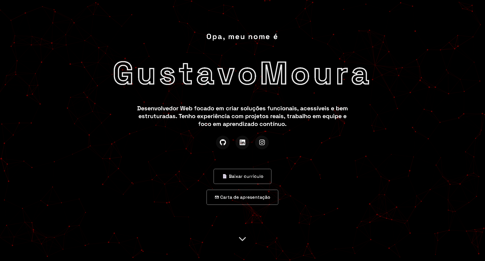
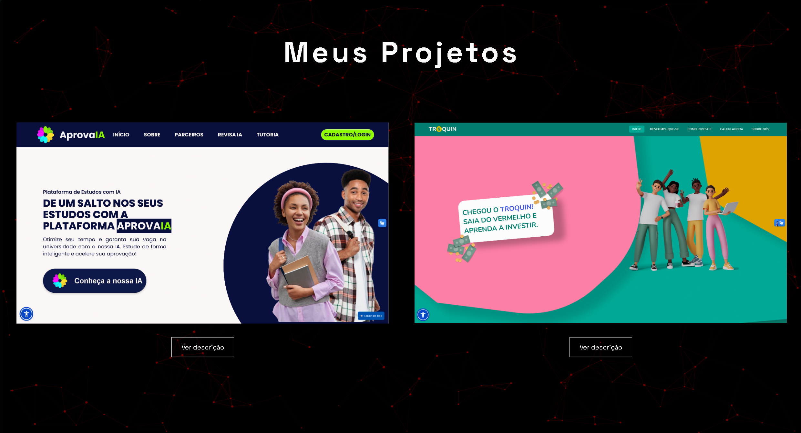
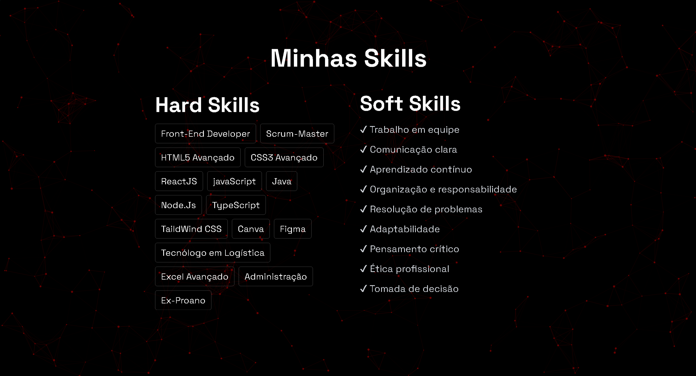

# Gustavo Moura | Portfolio

Portfólio desenvolvido com o objetivo de apresentar minhas habilidades, projetos e evolução na área de desenvolvimento web. O projeto foi criado utilizando tecnologias modernas do ecossistema Front-End, com foco em performance, responsividade e uma interface moderna.

## 🚀 Tecnologias utilizadas

- React
- TypeScript
- JavaScript
- TailwindCSS

## 🎯 Objetivo do projeto

A principal proposta deste portfólio é demonstrar minhas habilidades como desenvolvedor web, destacando meus conhecimentos técnicos, projetos desenvolvidos e minha evolução na área da tecnologia.

## ✨ Funcionalidades

- Interface moderna e responsiva
- Animações suaves
- Sessão de habilidades
- Links para redes sociais
- Download de currículo
- Carta de apresentação
- Efeitos visuais interativos

## 🌐 Deploy

Projeto hospedado na Vercel:

[Visualizar Projeto](https://meu-portifolio-three-alpha.vercel.app?utm_source=chatgpt.com)

## 📂 Repositório

[GitHub do Projeto](https://github.com/GustavoMouraDeJesus/Meu-Portifolio?utm_source=chatgpt.com)

## 📸 Preview

### Apresentação

  

### Projetos

  

### Skills

  

## 👨‍💻 Autor

Gustavo Moura

- GitHub: [@GustavoMouraDeJesus](https://github.com/GustavoMouraDeJesus?utm_source=chatgpt.com)
